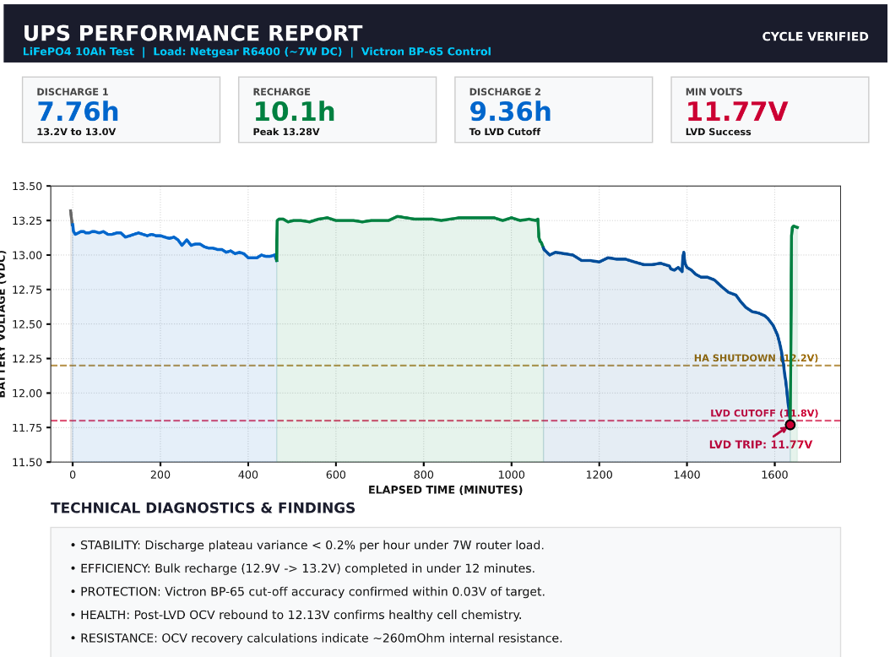
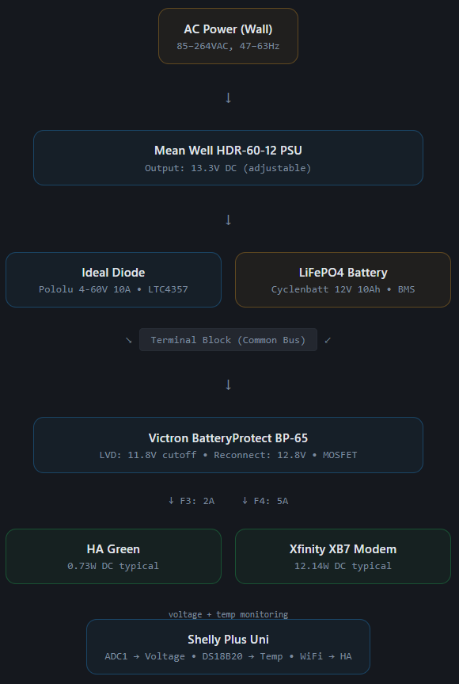
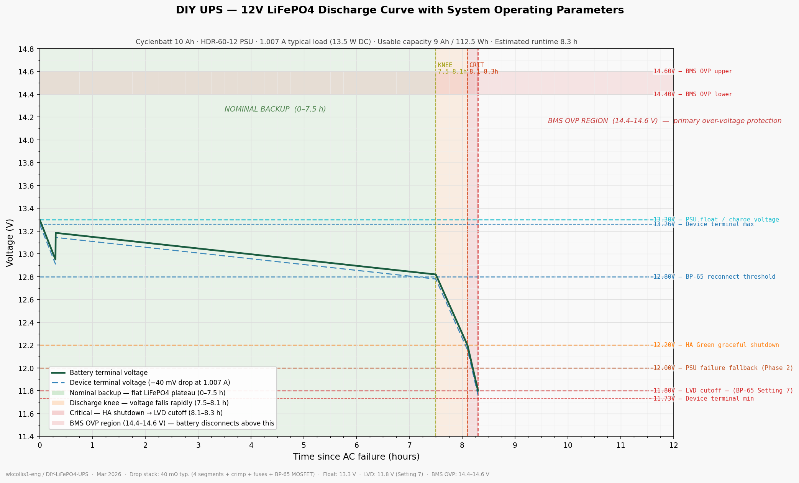
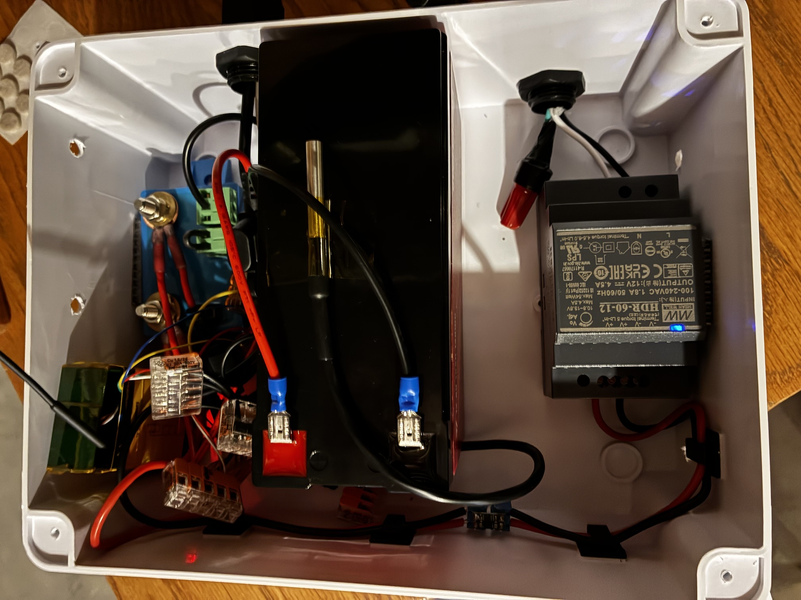
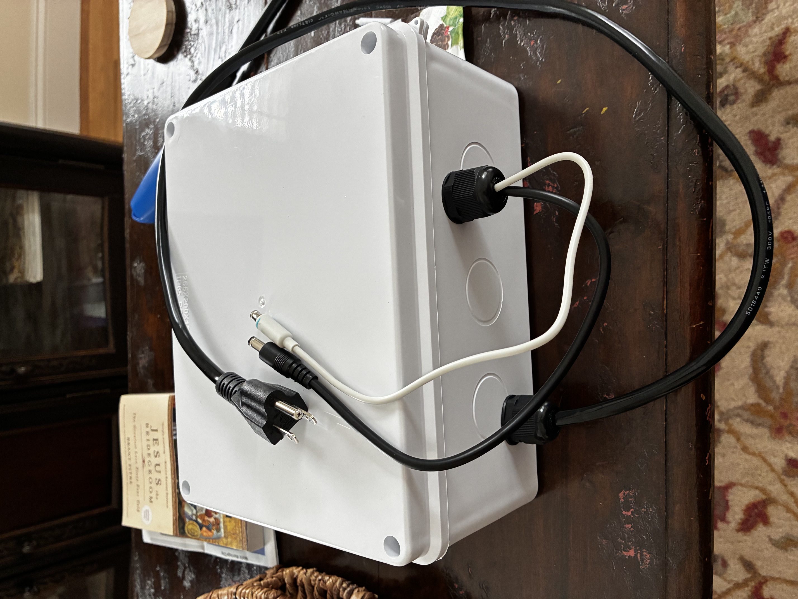

# DIY UPS for Home Assistant Green & Xfinity XB7 Modem

**12V LiFePO4-Based Uninterruptible Power Supply**

A 12V LiFePO4-based uninterruptible power supply for keeping a Home Assistant Green and Xfinity XB7 cable modem running during grid outages. Built into an IP65 enclosure with Home Assistant monitoring via Shelly Plus Uni.

> **Honest context:** A $85 APC BE600M1 would do the same job out of the box. This build costs roughly the same over 10 years as that option (based on battery replacements and electricity usage). The engineering rationale — longer battery life, faster switchover, direct HA integration, no DC-DC converter voltage regulation — is documented in [design-rationale.md](docs/design-rationale.md). Build this if those tradeoffs matter to you.

---

## ⚠️ Safety Warning

> [!CAUTION]
> **This project involves lithium batteries and AC mains voltage.** Improper handling can cause fire, electric shock, or equipment damage.

- ✅ **Disconnect AC power** before any work inside the enclosure
- ✅ Use appropriate **fusing** on battery connections
- ✅ Never charge LiFePO4 below **0°C (32°F)**
- ✅ Keep a **Class D fire extinguisher** accessible
- ✅ Review [docs/safety.md](docs/safety.md) before building

**Disclaimer:** Information provided for educational purposes only. Build at your own risk.

---
## Commissioning Results

---
## System Overview

AC grid powers a Mean Well HDR-60-12 PSU set to 13.3V float, which charges a 12V 10Ah LiFePO4 battery through a MOSFET ideal diode. On grid failure, loads switch directly to battery in under 1ms. A Victron BatteryProtect BP-65 disconnects loads at 11.8V to prevent over-discharge. A Shelly Plus Uni reports battery voltage and temperature to Home Assistant.

---

## Key Specifications

| Parameter | Value |
|---|---|
| PSU | Mean Well HDR-60-12, 13.3V float |
| Battery | Cyclenbatt 12V 10Ah LiFePO4 |
| Float voltage | 13.3V (set on PSU trimmer) |
| LVD cutoff | 11.8V (Victron BP-65, Setting 7) |
| LVD reconnect | 12.8V (30s delay after threshold met) |
| Device voltage envelope | 11.71–13.11V at terminals (2A worst-case) |
| Switchover time | <1ms (MOSFET ideal diode) |
| Typical load | 16.0W AC wall / 14.5W DC at devices (Kill-a-Watt measured) |
| Runtime at typical load | ~7.8 hours (DC-based) |
| Battery lifespan | 10–20 years (calendar aging at 13.3V float, 63–75°F) |
| Enclosure | LeMotech IP65 ABS, 9.6″×7.6″×4.5″ |
| Monitoring | Shelly Plus Uni → Home Assistant |
| Total build cost | ~$224 |

---

## Operating Modes

**Mode 1 — AC Present:** PSU outputs 13.3V through ideal diode; battery held at float equilibrium. Loads draw from PSU, not battery.

**Mode 2 — AC Failure:** PSU output drops to 0V. Ideal diode blocks. Battery feeds loads directly, no interruption.

**Mode 3 — Low Battery (~12.2V):** Shelly detects threshold via ADC. Home Assistant initiates graceful HA Green shutdown; modem continues on battery.

**Mode 4 — LVD Cutoff (11.8V):** Victron BP-65 disconnects loads after 90-second hold-off.

**Mode 5 — AC Restoration:** PSU resumes 13.3V, ideal diode switches source, BP-65 reconnects after 30s hold-off.

## Assembly Layout

*Elevation (top) and plan (bottom) views of LeMotech junction box. Dimensions in inches.*
---
## Assembly Pictures

---

## Documentation

| File | Contents |
|---|---|
| [docs/bom.md](docs/bom.md) | Full bill of materials with vendor, price, and notes |
| [docs/wiring.md](docs/wiring.md) | From/To wiring tables, fuse locations, component mounting |
| [docs/specifications.md](docs/specifications.md) | Electrical, performance, and protection spec tables |
| [docs/design-rationale.md](docs/design-rationale.md) | Build-vs-buy analysis, float charging strategy |
| [docs/component-selection.md](docs/component-selection.md) | Per-component selection rationale |
| [docs/cost-analysis.md](docs/cost-analysis.md) | Build cost breakdown and 10-year lifecycle comparison |
| [docs/safety.md](docs/safety.md) | AC and battery safety procedures |
| [docs/voltage-drop-analysis.md](docs/voltage-drop-analysis.md) | Wiring resistance and voltage drop calculations |
| [docs/supplemental-analysis.md](docs/supplemental-analysis.md) | Thermal Analysis & Enclosure Heat Budget, Runtime Analysis, Failure Modes & Effects Analysis (FMEA) |
| [docs/design-specification.md](docs/design-specification.md) | Formal requirements, design decisions, and verification matrix |

## Datasheets

- [Mean Well HDR-60-12](https://www.meanwell.com/Upload/PDF/HDR-60/HDR-60-SPEC.PDF)
- [Victron Smart BatteryProtect BP-65 — Datasheet](https://www.victronenergy.com/upload/documents/Datasheet-Smart-Battery-Protect-65-A--100-A--220-A-EN.pdf)
- [Victron Smart BatteryProtect — Manual](https://www.victronenergy.com/upload/documents/Smart_BatteryProtect_12V_24V/114439-Smart_BatteryProtect-pdf-en.pdf)
- [Shelly Plus Uni — Manual](https://kb.shelly.cloud/__attachments/176816159/Shelly%20Plus%20UNI%20multilingual%20printed%20user%20and%20safety%20guide.pdf?inst-v=01957c23-55ef-41a3-8fc1-d834919282d1)
---

## Related Projects

- [LiFePO₄ Battery Bank Study](https://github.com/wkcollis1-eng/Lifepo4-Battery-Banks) — 500Ah DIY battery bank with 130+ days of monitoring
- [Home Assistant Config](https://github.com/wkcollis1-eng/home-assistant-config) — HVAC monitoring implementation

---

## Status

- [x] Design complete
- [x] Components specified
- [x] Components ordered / received
- [x] Build complete
- [x] XB7 power measurement complete (14.7W avg, 20.3W peak — 1.066 kWh / 72.4 hr standalone)
- [x] Combined system power measurement complete (16.0W avg, 23.0W peak — 2.538 kWh / 158.8 hr)
- [ ] Home Assistant automation documentation

---

## Notes

- Device input voltage tolerance (±10%) is inferred from IEC 62368-1 design practice; neither Nabu Casa nor Comcast publish explicit DC input voltage ranges for these products.
- The PSU output trimmer is set to 13.3V and lacquered. Drift analysis shows expected aging drift of 3–5 mV/year — negligible relative to the 500mV headroom before OVP.
- No DC-DC converter is used. The direct battery feed strategy is documented in [design-rationale.md](docs/design-rationale.md).

