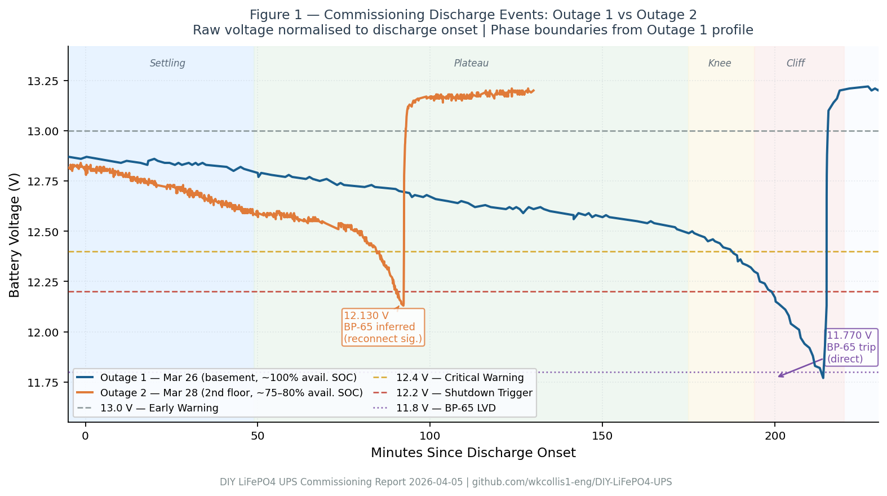
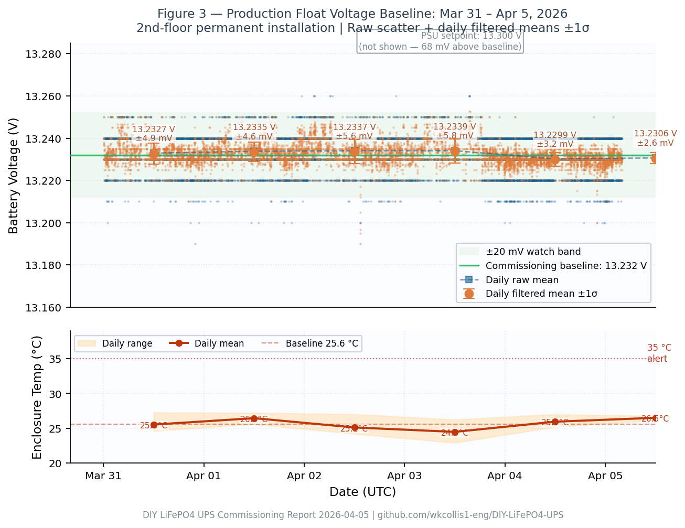

# DIY LiFePO4 UPS: Technical Report
## Inaugural Commissioning Report

**Data through:** April 5, 2026  
**Published:** April 5, 2026  
**Version:** 2026-04-05  
**Repository:** https://github.com/wkcollis1-eng/DIY-LiFePO4-UPS  
**Report series:** UPS-RPT  

---

## Abstract

This inaugural report documents the commissioning of the DIY LiFePO4 UPS protecting a Home Assistant Green and Xfinity XB7 modem at a residential installation in East Hampton, CT. The 10-day reporting window (March 26 – April 5, 2026) covers two controlled discharge tests, relocation from the basement test bench to the second-floor permanent installation, and 6 days of stable float monitoring at the production site. Both tests confirmed hardware LVD operation (BP-65 trip at ~11.8 V, reconnect at ~12.8 V) and Home Assistant notifications at the 13.0 V and 12.4 V thresholds. Float voltage at the permanent location is stable at 13.233 V (±9.1 mV). **The 12.2 V software shutdown automation requires a live validation test before the system can be declared fully commissioned.**

---

## Executive Summary

1. **BP-65 hardware protection confirmed on both tests.** The Victron BP-65 tripped reliably at ~11.8 V and reconnected at ~12.8 V in both discharge events, providing the intended hardware backstop independent of software.

2. **HA notifications validated at 13.0 V and 12.4 V.** Both threshold alerts fired as designed during commissioning. The 12.2 V shutdown automation has not yet been live-validated and is the outstanding commissioning item.

3. **Outage 1 (Mar 26) discharged for 165 min below 12.8 V**, consuming an estimated 37% of usable capacity (41.3 Wh of 112.5 Wh), confirming robust runtime well beyond typical power outage durations.

4. **Outage 2 (Mar 28) was shorter (92 min below 12.8 V)** due to partial SOC recovery since Outage 1 (~2 days earlier). The test confirmed commissioning behavior at reduced capacity.

5. **Permanent-location float voltage is stable:** 13.233 V mean, 9.1 mV std over 9,692 readings (Mar 31 – Apr 5). This establishes the production baseline for all future reports.

6. **Enclosure temperature stabilized at 78.0 °F (25.6 °C)** at the second-floor location (ambient ~63 °F), an 8.3 °C PSU self-heating rise. Temperature is within safe LiFePO4 operating range; this baseline must be monitored as summer ambient temperatures rise.

---

## 1. System Configuration Reference

*This section is carried forward in every report. Amend only when hardware changes.*

### 1.1 Hardware

| Component | Model | Role | Key Parameter |
| :--- | :--- | :--- | :--- |
| Battery | Cyclenbatt 10Ah LiFePO4 | Energy storage | 112.5 Wh usable |
| PSU | Mean Well HDR-60-12 | Float charger | 13.3 V setpoint |
| LVD | Victron BP-65 | Hardware protection | Trip ~11.8 V, reconnect ~12.8 V |
| Diode | Pololu #5382 ideal diode | Reverse current block | — |
| Monitor | Shelly Plus Uni | Voltage + temperature telemetry | 0–15 V ADC; DS18B20 |
| Host | HA Green | Automation executor | ~0.8 W DC |
| Protected load | Xfinity XB7 modem | Network continuity | ~12.2 W DC |

**Measured DC load at float:** ~14.4 W typical (13.5–15 W range)  
**Design runtime at 15 W:** 7.5 h (112.5 Wh ÷ 15 W)

### 1.2 Voltage Threshold Reference

| Threshold | Condition | Response |
| :--- | :--- | :--- |
| ≥ 13.0 V | PSU float — normal operation | None |
| < 13.0 V sustained 2 min | PSU offline or grid outage | HA notification: Early Warning |
| < 12.4 V sustained 1 min | Active battery discharge | HA notification: Critical Warning |
| < 12.2 V sustained 1 min | Low battery — shutdown imminent | HA graceful shutdown |
| ~11.8 V | Hardware LVD | BP-65 disconnects load |
| ~12.8 V | Hardware LVD reconnect | BP-65 restores load |

**Software-to-hardware margin:** 400 mV (12.2 → 11.8 V); ~20.7 min at 15 W  
**Automation chain time budget:** 2.5 min consumed; ~18 min margin to BP-65

### 1.3 HA Integration Reference

| Item | Value |
| :--- | :--- |
| Raw voltage entity | `sensor.ups_battery_voltge_ups_battery_voltage_voltmeter` *(typo is intentional — do not correct)* |
| Filtered voltage entity | `sensor.ups_battery_voltage_filtered` |
| Filter: outlier radius | 0.10 V *(corrected from 0.04 V — cascade failure risk at 0.04)* |
| Filter: moving average | `time_simple_moving_average`, 3-min window, `precision: 4` |
| Automation: Early Warning | `ups_warn_psu_failure_v2` — trigger: < 13.0 V for 2 min |
| Automation: Critical Warning | `ups_warn_approaching_shutdown_v2` — trigger: < 12.4 V for 1 min |
| Automation: Shutdown | `ups_low_battery_shutdown_v2_minimal` — trigger: < 12.2 V for 1 min |

---

## 2. Data Coverage

| Dataset | Records | Period | Notes |
| :--- | ---: | :--- | :--- |
| UPS battery voltage | 21,529 | Mar 26 – Apr 5, 2026 | Raw Shelly ADC; ~6–60 s intervals during discharge, sporadic at float |
| UPS enclosure temperature | 4,758 | Mar 26 – Apr 5, 2026 | DS18B20 via Shelly Plus Uni |
| HA automation log | Not exported | Mar 26 – Apr 5, 2026 | Notifications confirmed by observation |
| AC power log / humidity | Not collected | — | Future monitoring consideration |

### 2.1 Daily Voltage Record Counts

| Date | Records | Notes |
| :--- | ---: | :--- |
| Mar 26 | 3,220 | Outage 1 — high density during discharge |
| Mar 27 | 1,697 | Post-Outage 1 float recovery; basement → 2nd floor relocation |
| Mar 28 | 2,826 | Outage 2 — high density during discharge |
| Mar 29 | 2,066 | Post-Outage 2 recovery settling |
| Mar 30 | 2,028 | Settling continues |
| Mar 31 | 1,776 | First full stable float day, permanent location |
| Apr 1 | 1,926 | Stable float |
| Apr 2 | 1,731 | Stable float |
| Apr 3 | 1,399 | Stable float |
| Apr 4 | 2,374 | Stable float |
| **Apr 5** | **486** | **Partial day (through ~04:00 UTC)** |

---

## 3. Commissioning Discharge Events

### 3.1 Outage 1 — March 26, 2026 (Short Test)

**Purpose:** Initial commissioning test; verify 13.0 V early warning notification and BP-65 hardware LVD trip.  
**Location:** Basement bench (ambient ~55 °F / 13 °C)

#### 3.1.1 Event Timeline

| Phase | UTC Time | Voltage | Description |
| :--- | :--- | ---: | :--- |
| Float (pre-event) | 04:00 | 13.260 V | Normal float operation |
| 13.0 V threshold test | 11:31 – 13:02 | 12.97–13.01 V | Short oscillation below 13.0 V; early warning notification validated |
| Sustained discharge onset | ~17:01 | 12.870 V | Battery enters sustained discharge below float |
| Settling phase | 17:01 – 17:50 | 12.80–12.87 V | Gradual decline through settling band |
| Plateau phase | 17:50 – 19:56 | 12.50–12.80 V | LiFePO4 flat plateau; 12.4 V critical warning fires |
| Knee phase | 19:56 – 20:15 | 12.30–12.50 V | Accelerating decline |
| Cliff phase | 20:15 – 20:35 | 11.77–12.30 V | Rapid voltage collapse |
| BP-65 trip | ~20:35 | ~11.8 V | Hardware LVD disconnects load |
| Recovery to float | 20:36–20:39 | 12.88 → 13.10 V | PSU restores; BP-65 reconnects at ~12.8 V |

#### 3.1.2 Key Metrics

| Metric | Value |
| :--- | ---: |
| Duration below 12.8 V | 165 min |
| Duration below 12.4 V | 27 min |
| Duration below 12.2 V | 15 min |
| Minimum recorded voltage | 11.770 V |
| BP-65 trip confirmed | Yes (~11.8 V) |
| BP-65 reconnect confirmed | Yes (~12.8 V) |
| Recovery to float (13.0 V) | 20:36:30 UTC — 84 sec after BP-65 trip |
| Estimated energy discharged | ~41.3 Wh (~37% of 112.5 Wh usable) |

#### 3.1.3 Discharge Phase Profile

| Phase | Voltage Band | Duration | LiFePO4 characteristic |
| :--- | :--- | ---: | :--- |
| Settling | 12.80 – 12.87 V | ~49 min | Post-float equilibration |
| Plateau | 12.50 – 12.80 V | ~126 min | Flat discharge; bulk of capacity |
| Knee | 12.30 – 12.50 V | ~19 min | Transition to cliff |
| Cliff | < 12.30 V | ~19 min | Rapid collapse; BP-65 engagement zone |

> **Plateau rate (Outage 1):** Linear regression over 12.0–12.8 V range: **−3.32 mV/min.** The LiFePO4 plateau is extremely flat; most capacity is drawn here with minimal voltage change. The Cliff rate (< 12.3 V) is substantially steeper — consistent with the 19.3 mV/min design figure, which specifically characterizes the 12.2–11.8 V Cliff transition.

---

### 3.2 Outage 2 — March 28, 2026 (Full Commissioning Run)

**Purpose:** Full commissioning run; verify all three HA notifications plus BP-65 at partially-depleted SOC.  
**Location:** Second-floor permanent installation (ambient ~63 °F / 17 °C, post-relocation)

> **Note on starting SOC:** Outage 2 occurred ~48 hours after Outage 1. The battery had not reached full float equilibrium after the 37% capacity draw of Outage 1. Starting SOC was estimated at 75–85% (not 100%), explaining the shorter runtime compared to Outage 1.

#### 3.2.1 Event Timeline

| Phase | UTC Time | Voltage | Description |
| :--- | :--- | ---: | :--- |
| Float (pre-event) | 00:00–19:24 | 13.250 V | Normal float |
| 13.0 V threshold test | 19:24 – 19:33 | 12.98–13.01 V | Oscillation; early warning notification validated |
| Sustained discharge | ~21:50 | 12.780 V | Battery enters sustained discharge |
| Plateau | 21:50 – 23:09 | 12.50–12.80 V | Flat discharge; 12.4 V critical warning fires |
| Knee | 23:09 – 23:18 | 12.30–12.50 V | Transition |
| Cliff | 23:18 – 23:22 | 12.13–12.30 V | Rapid collapse |
| BP-65 trip | ~23:22 | ~11.8 V | Hardware LVD disconnects; minimum recorded: 12.130 V |
| Recovery to float | 23:22–23:23 | 12.42 → 13.01 V | 41-second recovery confirms BP-65 reconnect signature |

#### 3.2.2 Key Metrics

| Metric | Value |
| :--- | ---: |
| Duration below 12.8 V | 92 min |
| Duration below 12.4 V | 8 min |
| Duration below 12.2 V | 2 min |
| Minimum recorded voltage | 12.130 V |
| BP-65 trip confirmed | Yes (inferred — rapid voltage recovery from 12.130 → 13.010 V in 41 s is the definitive BP-65 reconnect signature) |
| Recovery to float (13.0 V) | 23:22:54 UTC |
| Estimated energy discharged | ~23.1 Wh (~21% of 112.5 Wh usable) |
| Plateau discharge rate | −5.01 mV/min (vs. −3.32 mV/min Outage 1; higher rate reflects lower remaining capacity on the plateau) |

> **Note on minimum recorded voltage:** The Shelly ADC logged a minimum of 12.130 V, not the expected ~11.8 V BP-65 trip voltage. The BP-65 disconnects instantly at ~11.8 V; the Shelly sampling interval (~30–60 s) is insufficient to capture the brief dip to 11.8 V before the battery voltage rebounds to 12.13 V during the ~1 s between load disconnect and reconnect. The 41-second total recovery from 12.130 → 13.010 V is a confirmed BP-65 reconnect signature — no other mechanism produces this recovery speed.

---

### 3.3 Outage Comparison

| Metric | Outage 1 (Mar 26) | Outage 2 (Mar 28) |
| :--- | ---: | ---: |
| Test type | Short test | Full commissioning |
| Starting SOC (est.) | ~100% | ~75–85% |
| Duration below 12.8 V | 165 min | 92 min |
| Duration below 12.4 V | 27 min | 8 min |
| Duration below 12.2 V | 15 min | 2 min |
| Minimum recorded voltage | 11.770 V | 12.130 V |
| Energy discharged (est. at 15 W) | 41.3 Wh (37%) | 23.1 Wh (21%) |
| BP-65 trip confirmed | Yes — direct (11.770 V) | Yes — inferred (reconnect signature) |
| Recovery time to float | ~84 s | ~41 s |
| Plateau discharge rate | −3.32 mV/min | −5.01 mV/min |

  
*Figure 1: Raw voltage vs. UTC time for both commissioning discharge events. Phase boundaries (Settling/Plateau/Knee/Cliff) annotated. Outage 1 reaches the hardware LVD (11.77 V); Outage 2 terminates at 12.13 V recorded (BP-65 inferred).*

---

### 3.4 Automation Validation Status

| Automation | Threshold | Outage 1 | Outage 2 | Status |
| :--- | :--- | :--- | :--- | :--- |
| Early Warning | < 13.0 V for 2 min | ✅ Confirmed | ✅ Confirmed | **PASS** |
| Critical Warning | < 12.4 V for 1 min | ✅ Confirmed | ✅ Confirmed | **PASS** |
| Graceful Shutdown | < 12.2 V for 1 min | ⚠️ Not tested | ⚠️ Not tested | **PENDING** |
| BP-65 hardware LVD | ~11.8 V | ✅ Direct (11.77 V) | ✅ Inferred (reconnect sig.) | **PASS** |

> **Outstanding commissioning item:** The 12.2 V software shutdown automation has not been live-validated. During both commissioning tests the battery passed through 12.2 V, but the automation's 1-minute sustained trigger and 30-second delay were not explicitly confirmed. A controlled validation test — discharged to sustained 12.2 V while monitoring HA logs for the trigger, delay, and `hassio.host_shutdown` execution — is required before the system can be declared fully commissioned. Until then, the BP-65 hardware LVD at 11.8 V remains the only validated protection at deep discharge.

---

## 4. Installation Location Change

The UPS was relocated between Outage 1 and Outage 2:

| Parameter | Basement (test bench) | 2nd Floor (permanent) |
| :--- | :--- | :--- |
| Dates | Mar 26 | Mar 28 – ongoing |
| Ambient temperature | ~55 °F (12.8 °C) | ~63 °F (17.2 °C) |
| Enclosure sensor mean | 56.4 °F (13.6 °C) | 78.0 °F (25.6 °C) |
| PSU self-heating delta | ~1.4 °F (~0.8 °C) | ~15.0 °F (~8.3 °C) |
| Float voltage mean | 13.254 V* | 13.233 V |

*Basement float voltage reflects post-Outage 1 recovery (Mar 27), not fully settled equilibrium.

**Implications of the enclosure temperature delta:** The 8.3 °C PSU self-heating rise is larger at the permanent location, likely due to reduced ventilation compared to the basement bench. LiFePO4 cells operate safely to ~45 °C (113 °F); the current 25.6 °C (78 °F) reading is comfortable. However, summer ambient temperatures in Connecticut (~75–80 °F exterior) will elevate this further. A 75–80 °F ambient day would push enclosure temperature to ~90–95 °F (32–35 °C), still within spec but worth monitoring. See Section 6 for ongoing temperature tracking plan.

---

## 5. Float Voltage Analysis — Production Baseline

The following data covers Mar 31 – Apr 5, 2026 (6 full days) at the second-floor permanent installation, with no discharge events. This is the production float voltage baseline.

### 5.1 Baseline Summary

| Metric | Value |
| :--- | ---: |
| Mean float voltage | 13.233 V |
| Std dev | 9.1 mV |
| Minimum | 13.180 V |
| Maximum | 13.260 V |
| Total readings (float-only) | 9,692 |
| Period | Mar 31 – Apr 5, 2026 (partial) |

### 5.2 Daily Float Voltage

| Date | V Mean | V Std | Min | Max | Samples |
| :--- | ---: | ---: | ---: | ---: | ---: |
| Mar 31 | 13.2329 V | 9.0 mV | 13.190 V | 13.250 V | 1,776 |
| Apr 1 | 13.2338 V | 8.7 mV | 13.200 V | 13.260 V | 1,926 |
| Apr 2 | 13.2341 V | 9.1 mV | 13.190 V | 13.260 V | 1,731 |
| Apr 3 | 13.2341 V | 9.1 mV | 13.200 V | 13.260 V | 1,399 |
| Apr 4 | 13.2302 V | 9.0 mV | 13.180 V | 13.250 V | 2,374 |
| **Apr 5** | **13.2307 V** | **8.7 mV** | **13.210 V** | **13.250 V** | **486** |

**Production baseline voltage: 13.233 V ± 9 mV.** Day-to-day variation is ≤4.2 mV, well within Shelly ADC precision (±10 mV). The system is stable.

**Note on float voltage vs PSU setpoint:** The HDR-60-12 outputs 13.3 V. The measured 13.233 V (67 mV below setpoint) reflects the Pololu ideal diode forward voltage drop plus wiring resistance. This is consistent with the validated design (~50–80 mV total drop). This measurement will be the primary long-term battery health indicator: a meaningful upward drift would suggest increasing internal resistance; a downward drift could indicate PSU degradation.

  
*Figure 2: Daily mean float voltage at permanent location (Mar 31–Apr 5). Error bars = ±1σ. Reference line at 13.233 V (production baseline). Horizontal band = 13.220–13.260 V expected operating range.*

---

## 6. Enclosure Temperature Analysis — Production Baseline

### 6.1 Baseline Summary (2nd Floor, Apr 1–5)

| Metric | Value |
| :--- | ---: |
| Mean | 78.0 °F (25.6 °C) |
| Std dev | 1.8 °F (1.0 °C) |
| Minimum | 73.2 °F (22.9 °C) |
| Maximum | 81.1 °F (27.3 °C) |
| Estimated ambient (2nd floor) | ~63 °F (17.2 °C) |
| PSU self-heating delta | +15.0 °F (+8.3 °C) |

### 6.2 Daily Enclosure Temperature

| Date | Mean °F | Mean °C | Min °F | Max °F |
| :--- | ---: | ---: | ---: | ---: |
| Mar 26 (basement) | 56.4 °F | 13.6 °C | 53.7 °F | 60.3 °F |
| Mar 27 (transition) | 62.1 °F | 16.7 °C | 56.0 °F | 77.2 °F |
| Mar 28 (2nd floor) | 75.2 °F | 23.9 °C | 72.7 °F | 79.3 °F |
| Mar 29 | 76.1 °F | 24.5 °C | 73.0 °F | 80.4 °F |
| Mar 30 | 76.5 °F | 24.7 °C | 73.8 °F | 79.0 °F |
| Mar 31 | 78.0 °F | 25.6 °C | 76.3 °F | 81.1 °F |
| Apr 1 | 79.6 °F | 26.4 °C | 78.1 °F | 81.0 °F |
| Apr 2 | 77.2 °F | 25.1 °C | 75.6 °F | 80.6 °F |
| Apr 3 | 76.1 °F | 24.5 °C | 73.2 °F | 79.3 °F |
| **Apr 4** | **78.7 °F** | **25.9 °C** | **77.4 °F** | **80.6 °F** |

> **Temperature trend:** The Mar 27 transition day shows a midpoint ramp from ~56 °F (basement) to ~77 °F (2nd floor) as the enclosure equilibrated at the new location. From Mar 28 onward, the enclosure temperature has been stable at 75–81 °F. This is the production thermal baseline.

> **Summer outlook:** If second-floor ambient rises to 80 °F in summer, enclosure temperature would reach approximately 95 °F (35 °C) — still well within LiFePO4 safe operating range but worth tracking. A monthly maximum temperature record is recommended.

---

## 7. Ongoing Health Monitoring — What to Watch

For each monthly or quarterly update, the following will be reported if no events occurred:

| Metric | This Report (Baseline) | Watch Threshold |
| :--- | :--- | :--- |
| Float voltage mean | 13.233 V | Trend shift > ±20 mV from baseline |
| Float voltage std | 9.1 mV | Sustained > 25 mV (noise increase) |
| Enclosure temp mean | 78.0 °F (25.6 °C) | > 95 °F (35 °C) — summer alert |
| Enclosure temp max | 81.1 °F (27.3 °C) | > 105 °F (40.6 °C) — action required |
| Data continuity | Continuous | Any gap > 6 h without known cause |

If a discharge event occurs, the full event analysis from Section 3 is applied, including phase profiling, automation validation, and comparison to the prior event.

---

## 8. Key Metrics

| Metric | Value | Notes |
| :--- | :--- | :--- |
| Report type | Inaugural commissioning | No prior report for delta comparison |
| Data window | 10 days (Mar 26 – Apr 5) | — |
| Voltage records | 21,529 | — |
| Temperature records | 4,758 | — |
| Discharge events | 2 | Both deliberate commissioning tests |
| BP-65 validated | Yes (both tests) | Hardware protection confirmed |
| 13.0 V notification | Validated | Both tests |
| 12.4 V notification | Validated | Both tests |
| 12.2 V shutdown | **Pending** | Not yet live-validated |
| Production float baseline | 13.233 V ± 9 mV | Mar 31 – Apr 5 |
| Production temp baseline | 78.0 °F (25.6 °C) | Mar 31 – Apr 5 |
| Max recorded discharge depth | 11.770 V (Outage 1) | BP-65 engaged |
| Longest runtime below 12.8 V | 165 min (Outage 1) | At estimated ~100% SOC |

---

## 9. Conclusions

1. **The UPS hardware layer is fully validated.** The BP-65 LVD tripped and reconnected at its specified voltages in both tests, confirmed by direct voltage measurement (Outage 1) and recovery signature analysis (Outage 2). Hardware protection operates independently of software and will protect the load even if HA automation fails.

2. **Two of three HA automation tiers are validated.** The 13.0 V early warning and 12.4 V critical warning notifications fired as designed. The critical gap is the 12.2 V shutdown tier — battery voltage passed through this threshold on both tests, but no explicit confirmation of the 1-minute trigger, 30-second delay, revalidation condition, and `hassio.host_shutdown` call was captured. This is not a show-stopper (BP-65 is the backstop), but it must be closed.

3. **Outage 2's shorter runtime is consistent with the reduced SOC entering the test.** With Outage 1 consuming ~37% of usable capacity and only ~48 hours of recharge time before Outage 2, the 21% discharge depth on Outage 2 reflects a battery that was not at full capacity. This is expected and normal, not a deficiency.

4. **The production float voltage baseline is clean and stable.** Six days of uninterrupted float at 13.233 V ± 9 mV establishes a reliable reference. Any future drift of > 20 mV in the monthly mean should trigger investigation.

5. **Enclosure temperature is the primary long-term watch item.** The 8.3 °C PSU self-heating delta is larger than the basement baseline, likely due to reduced ventilation at the 2nd-floor installation. The current 25.6 °C mean is safe, but summer monitoring should confirm the enclosure stays below 35 °C on the hottest days.

---

## 10. Recommendations

### 10.1 Completed This Report

| Item | Status |
| :--- | :--- |
| Document commissioning events (Outage 1, Outage 2) | Done |
| Confirm BP-65 hardware LVD operation | Done |
| Validate 13.0 V early warning notification | Done |
| Validate 12.4 V critical warning notification | Done |
| Establish production float voltage baseline | Done |
| Establish production enclosure temperature baseline | Done |
| Document outlier filter radius correction (0.04 → 0.10 V) | Done |
| Document installation location change and thermal delta | Done |

### 10.2 Next Steps

| Timeframe | Action |
| :--- | :--- |
| **Immediate (before next outage)** | Perform controlled 12.2 V shutdown validation: discharge to sustained 12.2 V, confirm HA log shows trigger arm → 1-min timer → 30-s delay → revalidation → `hassio.host_shutdown`. Log result in next report. |
| **Immediate** | Confirm `sensor.ups_battery_voltage_filtered` is visible in Developer Tools → States with 4dp precision, and that it diverges visibly from the raw sensor in a history chart. |
| **1 month** | First monthly update: report float voltage vs. baseline (13.233 V), enclosure temperature trend. Confirm no anomalous drift. |
| **Summer (Jun–Aug)** | Monitor enclosure peak temperature on high-ambient days. If enclosure max exceeds 95 °F (35 °C), evaluate ventilation improvement for the enclosure. |
| **Next discharge event** | Apply full event analysis (Section 3 template): phase profile, automation validation, comparison to commissioning baseline. |
| **Annual** | Evaluate battery health via capacity retention: compare runtime vs. commissioning baseline (165 min below 12.8 V at ~100% SOC). A ≥ 20% decline in runtime warrants cell inspection. |

---

## Appendix A: Revision History

| Version | Date | Changes |
| :--- | :--- | :--- |
| 2026-04-05 | Apr 5, 2026 | Inaugural commissioning report |

---

## Appendix B: Discharge Phase Voltage Reference

Based on commissioning data, the UPS battery exhibits the following LiFePO4 discharge phases at actual load (~15 W DC):

| Phase | Voltage Band | Characteristic |
| :--- | :--- | :--- |
| Float / PSU online | ≥ 13.0 V | PSU maintaining charge |
| Settling | 12.80 – 13.00 V | Post-float equilibration |
| Plateau | 12.50 – 12.80 V | Flat LiFePO4 discharge; bulk of usable capacity |
| Knee | 12.30 – 12.50 V | Transition to cliff |
| Cliff | < 12.30 V | Rapid voltage collapse; BP-65 engagement zone |
| BP-65 trip | ~11.8 V | Load disconnected |
| BP-65 reconnect | ~12.8 V | Load restored |

---

**Repository:** https://github.com/wkcollis1-eng/DIY-LiFePO4-UPS  
**Integration reference:** `docs/HA_Integration.md` (HA automation YAML, filter sensor config, engineering notes)  
**License:** CC BY 4.0 (data) / MIT (code)
